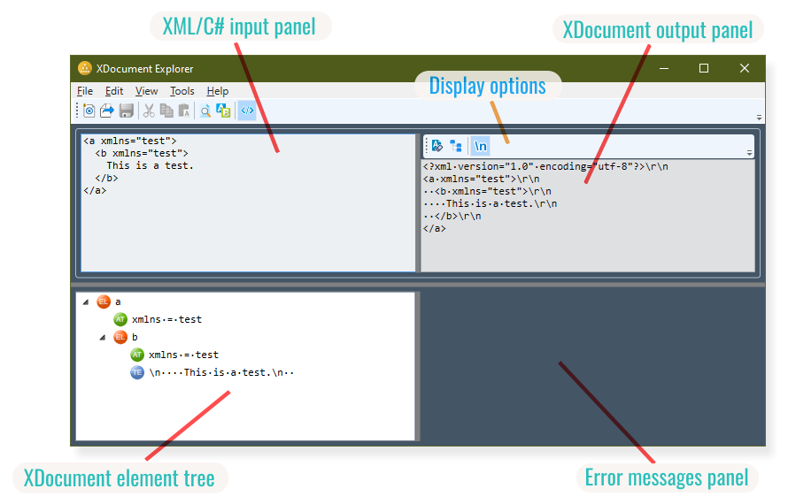
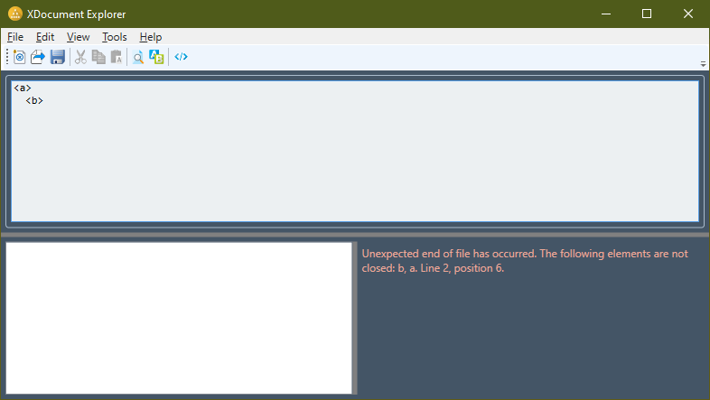

# .NET LINQ to XML Explorer

The .NET LINQ to XML Explorer tool makes it easy to browse an XML document tree created by Microsoft LINQ to XML.

With the .NET LINQ to XML Explorer tool you can now examine the result of how LINQ to XML converts an XML document into an object tree and serializes that object tree into a text string without stepping through [`XElement`](https://learn.microsoft.com/en-us/dotnet/api/system.xml.linq.xelement), [`XNode`](https://learn.microsoft.com/en-us/dotnet/api/system.xml.linq.xnode) and [`XAttribute`](https://learn.microsoft.com/en-us/dotnet/api/system.xml.linq.xattribute) object tree navigation methods during Visual Studio debugging sessions.

Just enter arbitrary [XML content](https://www.w3.org/TR/xml/) into the .NET LINQ to XML Explorer tool's text editor, or even compose an [`XDocument` document tree in C# code](https://learn.microsoft.com/en-us/dotnet/standard/linq/linq-xml-overview), and examine what is being created by .NET LINQ to XML.

## Features

.NET LINQ to XML Explorer provides many features for examining how LINQ to XML decodes and encodes XML:



### Comfortable Text Editor

Enter XML or C# code easily using the full-fledged text editor:

- Copy/cut/paste text
- Drag & drop text and text files
- Find/replace text (you can even use regular expression search terms)
- Load and save your XML source document or C# code for later retrieval

<br/>

**NB:** The .NET LINQ to XML Explorer text editor does not provide code editing features like code completion, automatic indentation or syntax highlighting.

### Examine XML Trees

Explore LINQ to XML using these great features:

- Choose between two modes for entering XML data:
  - Plain XML text
  - `XDocument` constructor, written in C#
- Get the resulting LINQ to XML object tree visually displayed
- Examine XML output created from the [`XDocument`](https://learn.microsoft.com/en-us/dotnet/api/system.xml.linq.xdocument) object tree
- Optionally display white-space characters and non-printable ASCII characters

## How To Use

.NET LINQ to XML Explorer can be used in two different modes:

Either enter literal XML text:


or create an [`XDocument`](https://learn.microsoft.com/en-us/dotnet/api/system.xml.linq.xdocument) tree


Use the `View > Use LINQ to XML` menu item to switch between Literal XML and LINQ to XML mode.

Literal XML text is evaluated immediately while you are typing. LINQ to XML content, however, will be evaluated when the <kbd>Submit</kbd> button is clicked.

Hover over an individual icon in the tree to unveil more of that XML node's details, e.g., the node's namespace.

Errors encountered while evaluating the XML or LINQ to XML text will be displayed in the lower right panel:



## Display Options

You can examine the XML document that is created from serializing the underlying [`XDocument`](https://learn.microsoft.com/en-us/dotnet/api/system.xml.linq.xdocument) by selecting `View > Show XDocument XML Output` or the corresponding toolbar button  :


The XML output panel comes with three different formatting options:

<dl>
	<dt> Disable Formatting
	</dt>
	<dd>Preserves all insignificant white space while serializing.</dd>
	<dt> Omit Duplicate Namespaces</dt>
	<dd>Removes the duplicate namespace declarations while serializing.</dd>
	<dt> Show Control Characters</dt>
	<dd>Escapes all non-printable ASCII characters</dd>
</dl>

Reach any of these options by selecting menu items available in `View > XDocument Formatting Options` or use the corresponding toolbar buttons right above the XDocument output panel.

## Tabs and Spaces

The Microsoft WPF [`TextBox`](https://learn.microsoft.com/en-us/dotnet/api/system.windows.controls.textbox) displays the tab character using a fixed width of eight spaces which is undesirable most of the time. So, by default, .NET LINQ to XML Explorer converts tab characters into space characters. This automatic conversion can be disabled in preference settings using the `Tools > Options` menu item.

When converting tabs into spaces, .NET LINQ to XML Explorer intelligently inserts as many spaces as a corresponding tab character would have displayed.

When you open a file, .NET LINQ to XML Explorer automatically performs an initial spacing conversion if enabled. The file will not be considered "modified" though. So, only the changes you make to the text will be considered a "change".

Use .NET LINQ to XML Explorer's options setting found at `Tools > Options` for disabling the tab character to space characters conversion as well as changing the number of spaces represented by the tab character. 

## How to Input LINQ to XML

In LINQ to XML mode, when you enter LINQ to XML into the text input box, make sure the final statement is an expression. Expressions in C# do *not* end with a semicolon.

So while this will work:

```c#
XDocument xd = new XDocument()

xd
```

The following version doesn't:

```c#
XDocument xd = new XDocument()

xd;
```

As you may see, there is a (redundant) trailing semicolon in the second version.

.NET LINQ to XML Explorer will try to remove trailing semicolons from your LINQ to XML code when evaluating your code, but fails doing so when semicolons are not the final non-whitespace character. This is, for example, the case when your final statement is followed by a comment.